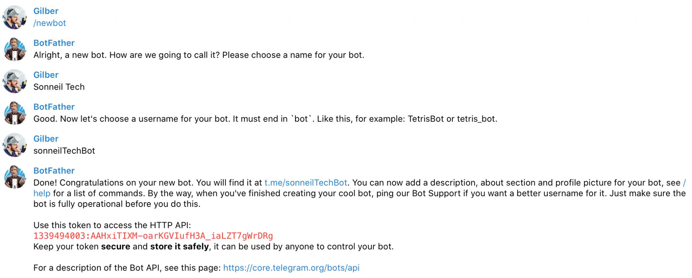

# Become aware of your app events in Telegram
> ### Example repository for [this article](https://www.sonneiltech.com/2020/10/become-aware-of-your-app-events-in-telegram/) on Sonneil Tech Blog :)

Sure you have used multiple services that allows you send app notifications, like [Pushover](https://pushover.net/) or even [IFTTT](https://ifttt.com/), but in this case, we are going to use Telegram to send notifications about what is happening in your application.

In Telegram, we can not just send notifications to users, so first and foremost we will need to sign up for a bot, which will be responsible of send on our behalf all the notifications we would like to send. To this end, Telegram has another bot called [@botFather](https://telegram.me/BotFather) (official Telegram bot), which we can use to create a new bot for us.



Once set name and username have been set, we would be provided with an **API key** to be used to make authenticated requests for our new bot.

## Setting up our webhook
For our example, we will set up our bot to work using webhook calls to our endpoint. In order to do this, we have an API method called [`setWebook`](https://core.telegram.org/bots/api#setwebhook).

We will configure our URL, where we will be waiting for requests, in example: http://testbot.test.com/webhook. Also we will register only for new messages, using the allowed_updates parameters:

```typescript
const apiKey = '1339494003:AAHxiTIXM-oarKGVIufH3A_iaLZT7gWrDRg';
const url = `https://api.telegram.org/bot${apikey}/setWebhook`;
const webhookUrl = 'http://testbot.test.com/webhook';

const result = await fetch(url, {
    method: 'POST',
    body: JSON.stringify({
        url: webhookUrl,
        allowed_updates: ['message']
    }),
    headers: {
        'content-type': 'application/json'
    }
});

```

Once completed, any message received by our bot, will be forwared to our webhook.

You might wonder, why should I configure an endpoint to receive message if I just want to send them? This is required in order to get the chat **identifier**, which relates an user with our bot, because of that will be the identifier we are going to use to send messages to our user.

## Getting the chat identifier
First of all, we will need to create a new controller for the previously defined webhook. To begin with, making a console.log and logging the body of the request, will be enough. After this, we will send a message to our bot (For instance, the suggested `/start` command).

We will not get any answer, but Telegram will be responsible of calling our webhook with a body like this one:

```json
{
   "update_id":9079187,
   "message":{
      "message_id":1,
      "from":{
         "id":283433899,
         "is_bot":false,
         "first_name":"Gilber",
         "username":"jgmullor",
         "language_code":"en"
      },
      "chat":{
         "id":283433899,
         "first_name":"Gilber",
         "username":"jgmullor",
         "type":"private"
      },
      "date":1601201881,
      "text":"/start",
      "entities":[]
   }
}
```

With this request, we got the identifier we were looking for, and the one with we can start sending notifications from our application events.

## The first message
Therewith, we are ready to send messages, so we will be using the [`sendMessage`](https://core.telegram.org/bots/api#sendmessage) API method, like in this example:

```typescript
const apiKey = '1339494003:AAHxiTIXM-oarKGVIufH3A_iaLZT7gWrDRg';
const url = `https://api.telegram.org/bot${apiKey}/sendMessage`;
const text = 'This is a test'
const chatId = '283433899';

const result = await fetch(url, {
    method: 'POST',
    body: JSON.stringify({
        chat_id: chatId,
        text: text,
        parse_mode: 'HTML'
    },
    headers: {
        'content-type': 'application/json'
    }
});
```
After this request…


At last we would have got a message from our bot!

## Hereon…

Now we are ready to send messages from our application, like critical events that require a prompt notice, but this is not the end, we can keep extending this into:
- **Receiving messages**: Configure your application based on received messages, or make requests without opening any browser or app, only sending a message to your bot (Example: Set order 93928 as sent using a command like `/sent 93928`)
- **Order status**: Allow your users to get updates about their orders, you can ask your users to send your bot a command like: `/status 93928 my@email.com` in order to get their order status.

Quite literally, the options are endless 🙂
